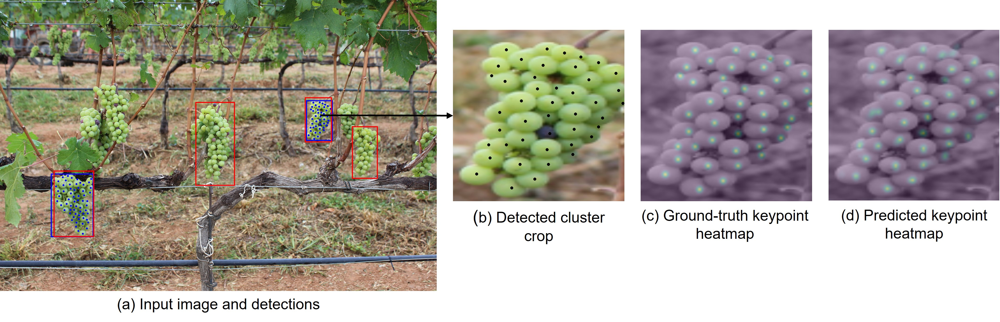
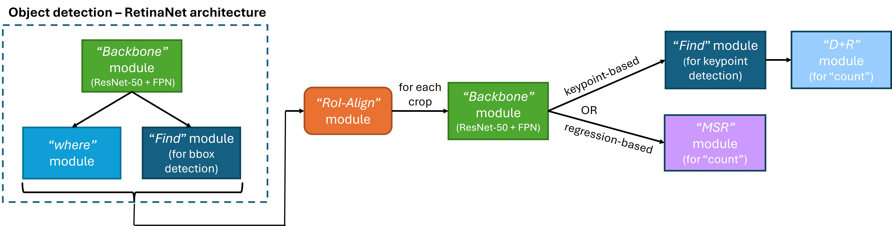
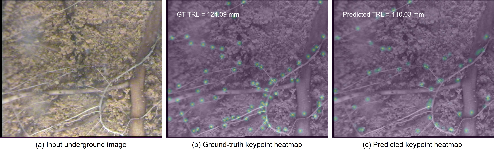
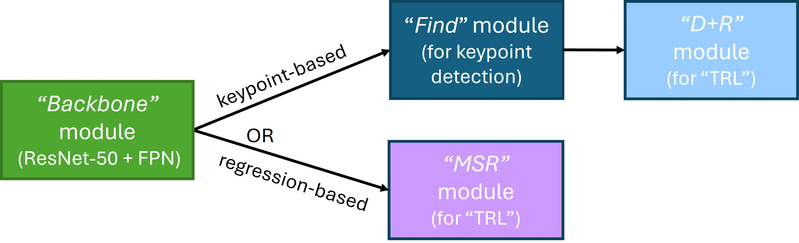
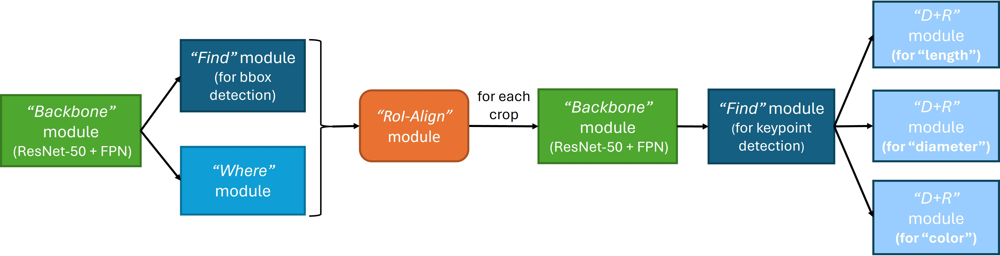
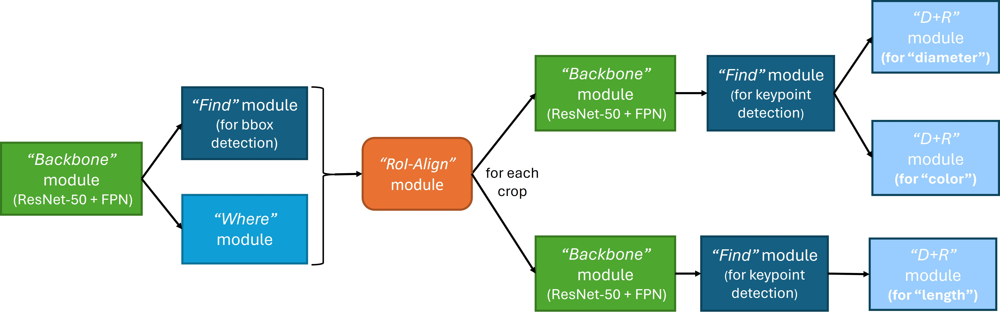

# LegoNet

**Modular deep-learning tools for plant phenotyping from field imagery**

LegoNet detects agricultural objects and estimates biologically meaningful
properties directly from images—such as berry counts for countable grape
clusters and grapevine-root length, diameter, and color.

The project combines object detection, keypoint estimation, regression, and
multi-branch attribute prediction in a reproducible PyTorch pipeline. It
includes automated dataset and checkpoint downloads, CPU-tested command-line
tools, training, inference, evaluation, visualization, and a Streamlit
interface.

The underlying methods have been published in
[*Computers and Electronics in Agriculture*](https://doi.org/10.1016/j.compag.2024.109457),
[*Plant Phenomics*](https://doi.org/10.34133/plantphenomics.0132), and
[*Remote Sensing*](https://doi.org/10.3390/rs13132496).

## Highlights

- Modular deep-learning architecture supporting direct per-image estimation
  and detection-based per-object counting and attribute estimation.
- End-to-end training, inference, evaluation, and visualization in PyTorch.
- Interchangeable keypoint- and regression-based estimation approaches.
- Demonstrated on two public datasets for grape berry counting and multi-task
  estimation of root length, diameter, and color.
- Validated command-line tools and a local Streamlit interface.
- CPU test coverage and continuous integration through GitHub Actions.

## Datasets

- `roots` uses the [Dataset of Grapevine roots with length, diameter, and color
  annotations](https://doi.org/10.5281/zenodo.8084106).
- `grapes` uses the [Embrapa Wine Grape Instance Segmentation Dataset
  (Embrapa WGISD)](https://github.com/thsant/wgisd).

See the dataset-specific guides for complete runtime layouts, annotation
details, evaluation scope, and reference results:

- [Embrapa WGISD grapes](docs/datasets/grapes_embrapa-wgisd.md)
- [Grapevine roots](docs/datasets/roots_grapevine.md)

## Visual examples

### Per-object counting - Grape berries



*Per-object grape berry counting. The full image (`CFR_1667.jpg` from the
[Embrapa WGISD dataset](https://github.com/thsant/wgisd)) shows (a) countable
grape-cluster annotations in blue and predicted bounding boxes in red; (b) a
detected cluster, which is cropped and passed to the keypoint-based
berry-counting estimator; and (c) and (d) the corresponding ground-truth and
predicted keypoint heatmaps, respectively.*

#### Architecture options



*Architecture options for per-object grape berry counting. A shared RetinaNet
detector locates grape clusters and RoI Align extracts each predicted crop. The
crop is then processed by either the keypoint-based or regression-based count
estimator selected with `--estimate-type`.*

### Per-image estimation - Total root length



*Total root length (TRL) estimation from the underground image
`T025_L084_2012.10.10_115421_002.jpg` from the
[grapevine-root dataset](https://doi.org/10.5281/zenodo.8084106): (a) raw input;
(b) ground-truth keypoint heatmap (TRL: 124.09 mm); and
(c) predicted keypoint heatmap (TRL: 110.03 mm).*

#### Architecture options

<p align="center">
  
</p>

*Direct per-image TRL estimation. The complete image is processed without
first detecting individual roots. The `keypoints` option uses the Find + D+R
architecture, while the `regression` option uses the MSR architecture.*

### Per-object attribute estimation - Roots

#### Per-root attributes with standalone keypoint estimators



*Standalone keypoint architecture for per-root attribute estimation. LegoNet
detects roots, extracts each predicted crop with RoI Align, and estimates
length, diameter, and color through separate keypoint-based output modules (D+R).*

#### Per-root attributes with the multibranch keypoint estimator



*Multibranch keypoint architecture for per-root attribute estimation. Length
uses a dedicated branch, while diameter and color share a second backbone and
keypoint-detection branch.*

Per-root predictions can subsequently be aggregated
into image-level TRL, mean diameter, and white-root fraction.

The supported configurations also include a regression-based per-root
attribute estimator, which is not shown in these two per-root diagrams.

The experiment scope, distinction between direct per-image estimation and
per-object aggregation, and staged verification plan are documented in
[`docs/reproduction.md`](docs/reproduction.md).

## Quick start

Create the recommended workspace and clone the repository as `Code`:

```bash
mkdir LegoNet
cd LegoNet
git clone https://github.com/Faina-Kh/LegoNet.git Code
cd Code
```

Choose CPU for basic inference or systems without a compatible NVIDIA GPU, or
use the [CUDA setup](#cuda-research-environment) for training and faster
inference. If you choose CPU, either create a Conda environment (recommended
for isolation within the CPU option):

```bash
conda create -n legonet-cpu python=3.12
conda activate legonet-cpu
```

or activate an existing isolated Python 3.12 environment. Then install the CPU
build of PyTorch followed by LegoNet:

```bash
python -m pip install torch==2.5.1 torchvision==0.20.1 --index-url https://download.pytorch.org/whl/cpu
python -m pip install -e .
```

Verify that the active environment imports this checkout and provides the CLI:

```bash
python -c "import legonet; print(legonet.__file__)"
legonet --help
```

The reported module path should be inside the current `LegoNet/Code` checkout.
If the import fails or points elsewhere, confirm that the intended environment
is active and repeat `python -m pip install -e .`.

Run keypoint-based grape counting on the public test set:

```bash
legonet \
  --dataset-name grapes \
  --network-type per_object_counting \
  --estimate-type keypoints \
  --run-script Inference \
  --val-set Test \
  --have-gt true \
  --to-draw true \
  --draw-detection-overview true \
  --draw-individual-object-visualizations false \
  --draw-gt-only false \
  --draw-per-object-estimation-visualizations true
```

On Linux, macOS, WSL, or Git Bash, use the multiline command above. In Windows
Command Prompt or PowerShell, run it on one line:

```cmd
legonet --dataset-name grapes --network-type per_object_counting --estimate-type keypoints --run-script Inference --val-set Test --have-gt true --to-draw true --draw-detection-overview true --draw-individual-object-visualizations false --draw-gt-only false --draw-per-object-estimation-visualizations true
```

Run per-root length, diameter, and color estimation with:

```bash
legonet \
  --dataset-name roots \
  --network-type per_object_attributes_multibranch \
  --estimate-type keypoints \
  --run-script Inference \
  --val-set Test \
  --have-gt true \
  --to-draw true \
  --draw-detection-overview true \
  --draw-individual-object-visualizations false \
  --draw-gt-only false \
  --draw-per-object-estimation-visualizations true
```

Both examples save a full-image detection overview showing the GT annotations
and predicted boxes, together with per-object crops and estimation heatmaps.
Separate box images and GT-only images remain disabled to limit redundant
output.

On the first run, LegoNet downloads the required public dataset files and
matching pretrained checkpoint, verifies them, and caches them in the storage
directory. See the environment section below and the
[detailed setup guide](docs/setup.md) for CUDA, custom paths, and development
setup.

Unsupported combinations fail before model or dataset construction.

## Streamlit GUI

Install the optional GUI dependencies, then start the local app:

```bash
python -m pip install -e ".[gui]"
streamlit run apps/streamlit_app.py
```

The GUI provides access to the supported datasets, network architectures,
estimation modes, checkpoint-loading options, and evaluation visualizations.
It supports automatic pretrained weights as well as local or uploaded
checkpoints, and previews the exact CLI command before launching a run.

For a typical inference run, select the storage location, dataset, network, and
estimate type. Keep **Checkpoint configuration** set to **Full model
checkpoint** and its source set to **Automatic download (recommended)**, then
choose `Test` or `Val` and select **Run LegoNet**.

See the [detailed setup guide](docs/setup.md) for storage selection, remote or
headless use, checkpoint uploads, and automatic dataset-download behavior.

## Environment setup

The Quick start above provides the lightweight CPU installation for normal
inference. For an editable local environment, testing, repository navigation,
and IDE debugging, see the [development guide](docs/development.md). Full
training and research inference use the CUDA environment below.

### CUDA research environment

The supplied Conda environment targets Python 3.12, PyTorch 2.5.1, and CUDA
12.1. Create it with Conda or Mamba:

```bash
conda env create -f environment.yml
conda activate legonet
python -m pip install --no-deps -e .
```

The CUDA-specific PyTorch wheels in `environment.yml` require a compatible
NVIDIA driver. CPU-only and other CUDA configurations require an appropriate
PyTorch installation for that machine.

Check the public CLI without starting an experiment:

```bash
legonet --help
```

The thin `python scripts/run_legonet.py` entry point remains available for
running directly from a source checkout, including from an IDE such as PyCharm.

### Storage directory

For the recommended workspace layout, clone the repository as `Code`. LegoNet
then keeps source files separate from downloaded datasets, experiment results,
and checkpoints:

```text
LegoNet/
├── Code/          Git repository and installed project source
├── Datasets/      Downloaded datasets and copied annotation metadata
├── ExpResults/    Training and inference results
└── checkpoints/   Downloaded pretrained weights
```

When the checkout is named `Code`, its parent is used as the default storage
root. Use `--storage-path` or `LEGONET_STORAGE_PATH` to select another location.
See the [detailed setup guide](docs/setup.md) for the complete runtime layout,
custom-path examples, and environment-variable configuration.

## Supported configurations

| Dataset | Network type | Estimate type |
|---|---|---|
| `grapes` | `bbox_detection` | Not used by the detector |
| `grapes` | `per_object_counting` | `keypoints` or `regression` |
| `roots` | `bbox_detection` | Not used by the detector |
| `roots` | `per_image_estimation` | `keypoints` or `regression` |
| `roots` | `per_object_attributes` | `keypoints` or `regression` |
| `roots` | `per_object_attributes_multibranch` | `keypoints` |

The `--estimate-type` option selects one of two estimator-based architectures:

- `keypoints` uses explicit keypoint detection. The model predicts
  keypoint heatmaps and derives the requested count or attribute from those
  intermediate predictions.
- `regression` uses direct regression from feature-pyramid representations,
  without producing keypoint heatmaps.

## Training

Training requires ground-truth annotations and uses the `Val` validation
split. Select a supported dataset, network type, and estimate type from the
table above, then use `--run-script Training`.

## Automatic dataset setup

If the selected public dataset is incomplete, LegoNet announces the source and
destination before downloading the missing data. Existing complete datasets are
reused without downloading them again.

For grapes, only the 300 resized `.jpg` files referenced by the tracked LegoNet
split annotations are downloaded from WGISD; upstream `.txt` and `.npz` files
are skipped. The small grape annotation and license files are packaged with the
code (`src/legonet/resources/datasets`) and copied into `Datasets/` during
first-time setup.

For roots, the published ZIP is downloaded from Zenodo, checksum verified,
safely extracted, and checked for the expected split files. Pass
`--download-missing-data false` to disable network-based dataset setup.

Datasets can also be prepared or checked without starting inference:

```bash
legonet-data download grapes
legonet-data download roots
legonet-data download all
legonet-data verify all
```

From a source checkout, the equivalent entry point is
`python scripts/download_datasets.py download grapes`.

## Checkpoint loading

For inference, LegoNet uses the matching published pretrained checkpoint by
default, downloading and caching it when needed. You can instead supply your
own full or task-specific checkpoints, or disable weight loading.

See [`docs/pretrained_weights.md`](docs/pretrained_weights.md) for loading
modes, checkpoint inventory and provenance, local-path options, checksums,
limitations, and conversion utilities.

## Evaluation

The experiment scope and the distinction between direct per-image estimation
and per-object aggregation are documented in
[`docs/reproduction.md`](docs/reproduction.md).

Evaluation scope, metrics, code-output comparisons with the relevant paper results,
and known limitations can be seen in the dataset-specific documentation in
[`docs/datasets`](docs/datasets).

Evaluation can optionally generate full-image detection overviews, per-object
crops, and keypoint visualizations. See [`docs/reproduction.md`](docs/reproduction.md)
for visualization options and guidance.

## Tests

Run the default CPU test suite:

```bash
python -m pytest -m "not slow and not gpu"
```

The suite validates installation, CLI behavior, dataset handling, checkpoint
utilities, and evaluation logic without requiring research datasets or a GPU.
GPU experiments and scientific result reproduction are documented separately
in [`docs/reproduction.md`](docs/reproduction.md). Local development setup,
focused test commands, and IDE debugging are documented in the
[development guide](docs/development.md).

## Citation

If you use LegoNet, cite the paper associated with the model or dataset used in
your work. Machine-readable software and preferred-paper citation metadata is
available in [`CITATION.cff`](CITATION.cff). The relevant publications are
listed with each dataset below.

## Data and licensing

### Grapevine roots

The active `roots` configurations use the [Dataset of Grapevine roots with
length, diameter, and color annotations](https://doi.org/10.5281/zenodo.8084106),
created by Faina Khoroshevsky, Kaining Zhou, and Naftali Lazarovitch. The
dataset is distributed under the
[CC BY 4.0 license](https://creativecommons.org/licenses/by/4.0/) and is the
dataset associated with the preferred 2024 *Computers and Electronics in
Agriculture* citation above.

See the [roots dataset guide](docs/datasets/roots_grapevine.md)
for the expected runtime layout, attribute encoding, and object-level and
image-level evaluation rules.

Cite the associated work as:
> F. Khoroshevsky, K. Zhou, A. Bar-Hillel, O. Hadar, S. Rachmilevitch,
> J. E. Ephrath, N. Lazarovitch, and Y. Edan, "A CNN-based framework for
> estimation of root length, diameter, and color from in situ minirhizotron
> images," *Computers and Electronics in Agriculture*, vol. 227, article
> 109457, 2024. <https://doi.org/10.1016/j.compag.2024.109457>

An earlier, related collection is the [Dataset for "Root Length Estimation:
Automated Minirhizotron Image Analysis with Convolutional Networks without
Segmentation"](https://doi.org/10.5281/zenodo.7482146). It contains 4,015
minirhizotron images from four crop species and is also distributed under
CC BY 4.0. Its associated paper is:

> F. Khoroshevsky, K. Zhou, S. Chemweno, Y. Edan, A. Bar-Hillel, O. Hadar,
> B. Rewald, P. Baykalov, J. E. Ephrath, and N. Lazarovitch, "Automatic Root
> Length Estimation from Images Acquired In Situ without Segmentation,"
> *Plant Phenomics*, vol. 6, article 0132, 2024.
> <https://doi.org/10.34133/plantphenomics.0132>

### Grapes

The active `grapes` configurations use the [Embrapa Wine Grape Instance
Segmentation Dataset (WGISD)](https://github.com/thsant/wgisd).
WGISD is distributed under the
[CC BY-NC 4.0 license](https://creativecommons.org/licenses/by-nc/4.0/).

LegoNet uses the resized JPEG images published in WGISD's
[`data/` directory](https://github.com/thsant/wgisd/tree/master/data), not the
images in
[`original_resolution/`](https://github.com/thsant/wgisd/tree/master/original_resolution).
The `train.txt`, `val.txt`, and `test.txt` files required by LegoNet are
preprocessed, LegoNet-specific inputs. They were prepared separately by
combining two annotation types:

```text
image.jpg,grapes,x1,y1,x2,y2  # grape-cluster bounding box
image.jpg,grapes,x,y          # contributed berry-point annotation
```

Release copies of these inputs and their class mapping are included in
[`src/legonet/resources/datasets/Embrapa WGISD/`](src/legonet/resources/datasets/Embrapa%20WGISD/).
Dataset-specific documentation is available in the
[grape dataset guide](docs/datasets/grapes_embrapa-wgisd.md).

The combined files retain all 300 WGISD images across the three splits, while
berry-point rows are available for a subset of 111 images. These files are not
generated by LegoNet, and downloading the original WGISD annotation files does
not reproduce them. At runtime, the active grape configuration removes images
without contributed berry points and removes bounding boxes containing no
contributed berry points.

Cite the associated work as:

> F. Khoroshevsky, S. Khoroshevsky, and A. Bar-Hillel, "Parts-per-Object Count
> in Agricultural Images: Solving Phenotyping Problems via a Single Deep
> Neural Network," *Remote Sensing*, vol. 13, no. 13, article 2496, 2021.
> <https://doi.org/10.3390/rs13132496>

The wheat and banana datasets discussed in that paper are owned by the Israel
Phenomics Consortium and are not public. They are not redistributed by this
project.

### License boundaries

The LegoNet source code is distributed under the
[BSD 3-Clause License](LICENSE). Dataset files and derived annotations retain
their respective licensing terms and are not covered by the source-code
license.
